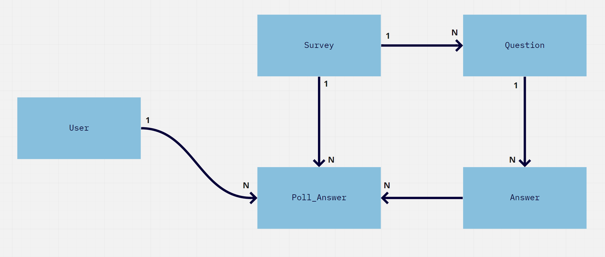

# Desafio programação - para vaga desenvolvedor Ruby on Rails

O desafio é criar um sistema de enquete.

## Pontos importantes

* Escrever uma aplicação usando Ruby on Rails onde eu (como usuário logado) possa criar enquetes
* Cada enquete deve ter uma pagina com URL amigável
* Cada usuário pode votar apenas uma vez (lembrando que estou rodando em rede interna e só tem eu como usuário, ou seja, deve ser limitado o voto por session), não precisa estar logado para votar
* Na página da enquete deve conter a enquete para ser respondida, após votar deve aparecer um gráfico com a porcentagem de voto em cada opção
* Testes unitários

# Entidade Relacionamento

# Instruções para executar o projeto

1. Tenha o ruby 2.6.6 instalado.
2. Tenha o rails 6.0.3.3 instalado.
3. Tenha o PostgreSQL na versão miníma 10.
4. Clone esse repositório.
5. Execute `bundle install` para instalar todas as gems e dependências do projeto.
6. Execute `yarn install` para instalar todas as dependências do projeto.
7. Na pasta `config` no arquivo `database.yml` e configure seu usuário e senha do PostgreSQL.
8. Execute `rails db:create; rails db:migrate; rails db:test:prepare`.
9. Para realizar a bateria de teste do RSPEC execute `bundle exec rspec`.
10. Para testar no navegador execute `rails s` ou `rails server`, abra o navegador e digite `localhost:3000` e realize os testes.

Obrigado ;)
